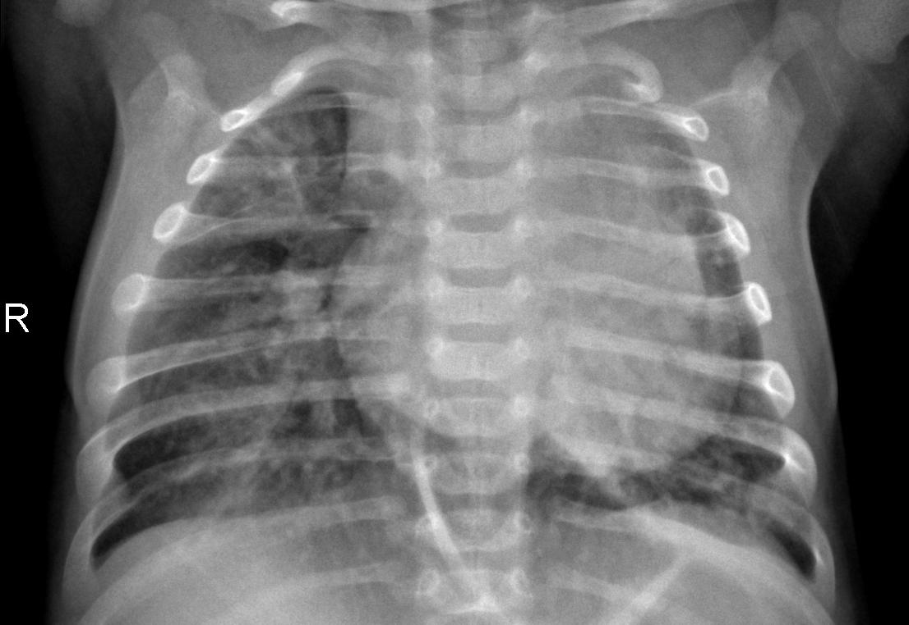
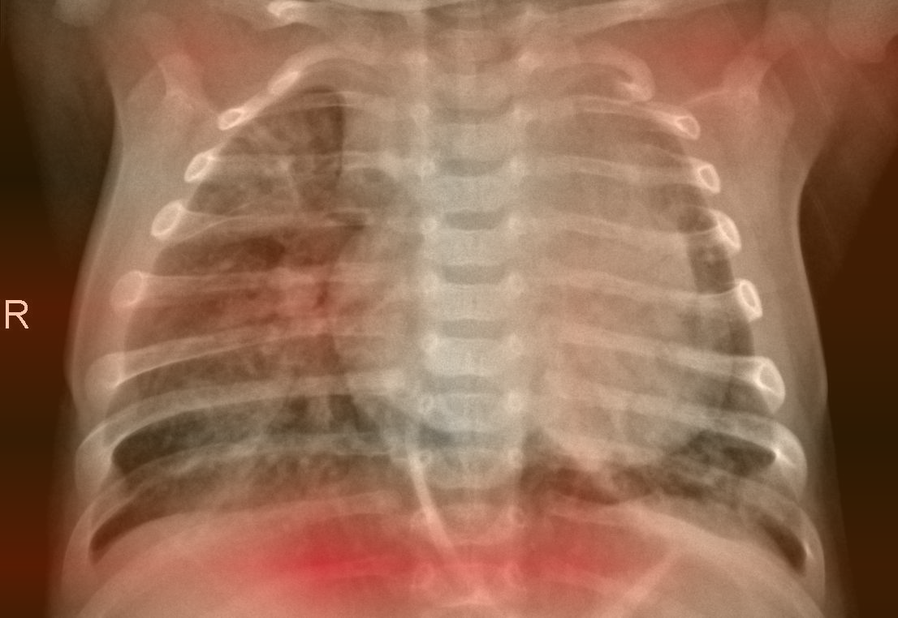

# PneumoLens

**Look beyond the prediction.** An interactive chest X-ray classifier with Grad-CAM, inspectable errors, and reproducible model experiments.

Python · PyTorch · ResNet-18 · Vanilla JavaScript · Canvas

| Original public X-ray | Actual baseline Grad-CAM |
| --- | --- |
|  |  |

Kermany, Zhang & Goldbaum, CC BY 4.0. The overlay is a modified image. Attribution shows model influence, not validated disease locations.

## Try it in one command

From this folder, with Python 3.11 or later:

```bash
python3 demo.py
```

Open **http://127.0.0.1:8503/**. No package installation, dataset download, or weights are required for this **recorded demo**. It presents saved real predictions and both classes' Grad-CAM maps from the two evaluated models. A persistent label distinguishes recorded outputs from live inference. Uploads are available only in the full app.

The small gallery contains the union of the first example of each outcome for each model, selected in test-manifest order. It is a deliberately selected illustration of successes and errors. Gallery counts describe these bundled examples; Evaluation reports all 624 test images.

## What to explore

A light interface with teal accents keeps results and controls readable, while the dark X-ray viewer gives the scan its own space. The layout adapts to desktop and phone screens.

- Drag the comparison divider or use its keyboard-accessible slider.
- Zoom and pan the original image and overlay together; change opacity without rerunning inference.
- Switch the explained class while keeping the prediction fixed.
- Follow confusion-matrix cells to actual examples, including mistakes.
- Compare frozen-feature and fine-tuned models, including measures that worsened.
- Export a full-image PNG with model, class, opacity, score, and source context.

For a short presentation, follow the [90-second walkthrough](docs/portfolio.md). See the [model card](docs/model-card.md) for intended use and limitations.

## Measured results

One seed, fixed 0.50 threshold, 624 test images (234 normal, 390 pneumonia). Fine-tuning was selected by validation loss. The test partition was already examined for the baseline, so the follow-up is an **exploratory comparison on a reused test set**, not independent validation.

| Test metric | Frozen baseline | Fine-tuned |
| --- | ---: | ---: |
| Accuracy | 78.0% | 78.8% |
| Pneumonia recall | 99.0% | 99.7% |
| Normal recall | 43.2% | 44.0% |
| AUROC | 0.945 | 0.955 |
| Brier score ↓ | 0.167 | 0.179 |
| False positives / false negatives | 133 / 4 | 131 / 1 |

**The limitation is part of the project:** fine-tuning still falsely flags 131 of 234 normal-labeled images, and probability error worsens. High pneumonia recall does not mean the model is ready for clinical use. The four-image [parameter-randomization check](docs/sanity/results.json) and [comparison sheet](docs/sanity/randomization.png) also show why plausible heatmaps need scrutiny.

Full records: [baseline metrics](docs/test-metrics.json), [fine-tuned metrics](docs/finetuned-test-metrics.json), [fine-tuning protocol](docs/finetuning-protocol.md), [split audit](docs/split-audit.json).

## Run real inference

```bash
python3.11 -m venv .venv
source .venv/bin/activate
python -m pip install -r requirements.txt
python serve.py
```

Open **http://127.0.0.1:8502/**. This mode needs matching trained checkpoints, evaluations, and the public dataset under `artifacts/` and `data/`. Those large files are intentionally excluded from Git. Follow the [reproduction guide](docs/reproduction.md) to prepare data, train and evaluate on a fresh checkout. Existing local artifacts work directly.

The full app supports all 624 test cases and new 8-bit PNG/JPEG uploads. Images are processed in memory; up to eight recent results are cached in browser memory until reload. The source-image display is at most 1280 pixels per side. PNG exports add a context footer. The original Streamlit interface remains available via `python -m streamlit run app.py --server.address 127.0.0.1` on port 8501.

To regenerate the recorded assets from evaluated local models:

```bash
python -m pneumolens.export_demo
```

The exporter verifies the inference scores against their evaluation records and records checkpoint hashes and asset checksums. Both modes run locally; no public deployment is included.

## Engineering and verification

```bash
python -m pip install -r requirements-dev.txt
python -m pytest -q
node --test tests/*.test.mjs
node --input-type=module --check < web/app.js
```

Tests cover Grad-CAM math, class dependence, hook cleanup, geometric alignment, split leakage, fine-tuning boundaries, API input handling, recorded-asset integrity, and selected-gallery versus full-evaluation counts. See [verification details](docs/verification.md). CI runs Python 3.11 and Node 22.

| File | Responsibility |
| --- | --- |
| `demo.py` | Standard-library server for the recorded demo |
| `serve.py`, `pneumolens/server.py` | Local inference API and checkpoint verification |
| `web/app.js`, `web/viewer.mjs` | UI state, comparison canvas and exports |
| `web/recorded.mjs`, `web/demo/` | Explicit recorded mode and verified model outputs |
| `pneumolens/gradcam.py` | Gradient-weighted class activation, implemented explicitly |
| `pneumolens/prepare.py`, `data.py` | Conservative grouped split and duplicate checks |
| `pneumolens/train.py`, `finetune.py` | Baseline and validation-selected fine-tuning |
| `pneumolens/evaluate.py`, `sanity.py` | Metrics and explanation experiments |

## Project context and attribution

PneumoLens complements **Neural Canvas** (neural networks from scratch) and **Chroma Lab** (clustering and color) with transfer learning, model interpretation, and evaluation under dataset limitations.

Educational research only. Grad-CAM does not segment infected tissue, establish the cause of a prediction, or validate medical findings. Filename-derived groups are not verified patient identities. No external clinical validation has been performed.

Dataset: [Kermany, Zhang & Goldbaum, version 2](https://data.mendeley.com/datasets/rscbjbr9sj/2), mirrored by [Chest X-Ray Images (Pneumonia)](https://www.kaggle.com/datasets/paultimothymooney/chest-xray-pneumonia). Included public images and derived maps retain CC BY 4.0 attribution. See [third-party notices](THIRD_PARTY_NOTICES.md).

Implementation created with AI assistance. Understand the model, experiments, and limitations before presenting the work.
